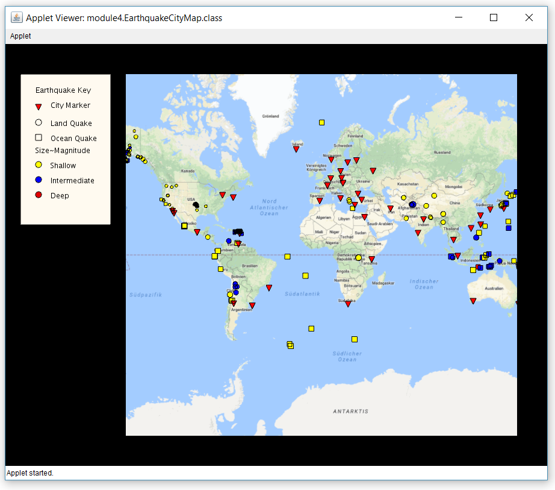

# EarthquakesVisualize

### Concept:
Interactive graphical tool in Java Applets to visualize Earthquakes around the world using markers based on magnitude,location and depth of earthquake.

Also, contains a legend to help interpret the maps. 

### Demo:

